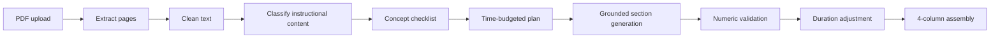

# Lesson Script Studio

A full-stack prototype for generating grounded, duration-aware educational video scripts from lesson PDFs. The UI is a React/Vite workspace; the API is FastAPI with independently testable pipeline stages.

## Run locally

```powershell
npm install
npm run dev
```

In a second terminal:

```powershell
cd backend
python -m venv .venv
.venv\Scripts\Activate.ps1
pip install -r requirements.txt
uvicorn main:app --reload --port 8000
```

The frontend includes a deterministic `MY BODY` demo state so the workflow can be evaluated without an API key. The backend currently uses a local fallback generator; a provider adapter can replace `generate_sections` without changing the pipeline contract.

## Architecture



Every generated row carries source page tags. Validation reports coverage, groundedness, readability, and estimated duration. The classifier is intentionally heuristic and inspectable, with an extension point for LLM classification of ambiguous pages such as a kite activity that teaches a concept versus a graded quiz.

## API contract

`POST /api/generate` accepts multipart fields `file`, `grade`, `duration`, `style`, and `instructions`, then returns `{ script, validation, artifacts }`.
